# Phase 01 — Evidence synthesis · Pictorial walkthrough

> **Phase context.** Before any new study runs, the team needs to know what the existing evidence
> base looks like — for the protocol's background, the IRB packet's "what's known", the grant's
> justification of need, and for guideline / HTA submissions whose entire artefact is a synthesis.
> This phase covers everything from the first search query through the published systematic review.

Captured against a **live instance** (`http://localhost:8000`, AWS Bedrock `claude-haiku-4-5`) on
2026-06-19. Phase 01 has **8 demos (E1–E8)**. This guide gives the **three core, richest demos
(E1–E3) full pictorial treatment**; E4–E8 are summarised as triggers + expected output at the end
(they reuse the same card/page patterns and, for NMA/IPD/GRADE, deliver their value as downloadable
PDF reports).

## Setup notes
- Run the stack auth-disabled (blank Cognito) for clean single-user capture — see the Phase 02 guide.
- **E1 (and E4/E5) render their forest/network plots in the Docker sandbox** — build it once:
  `docker build -t research-assistant-sandbox:latest ./sandbox`.
- The chat UI requires the Babel 7 pin in `index.html` / `sr.html` (see Phase 02 guide's CDN note).
- E2b (search) and E3 (ingest) hit **live PubMed**.

---

# E1 — Meta-analysis on synthetic data (≈ 5 min)

End-to-end meta-analysis with anti-hallucination guardrails: PICO → search → extraction → forest
plot, all inside the sandbox. Deterministic because the extraction data is supplied.

**Step 1 — New conversation, paste the research question:**

```
Does adding a proton pump inhibitor to dual antiplatelet therapy reduce upper GI bleeding in patients who recently underwent PCI for acute coronary syndrome?
```

The model returns a structured **PICO** card.

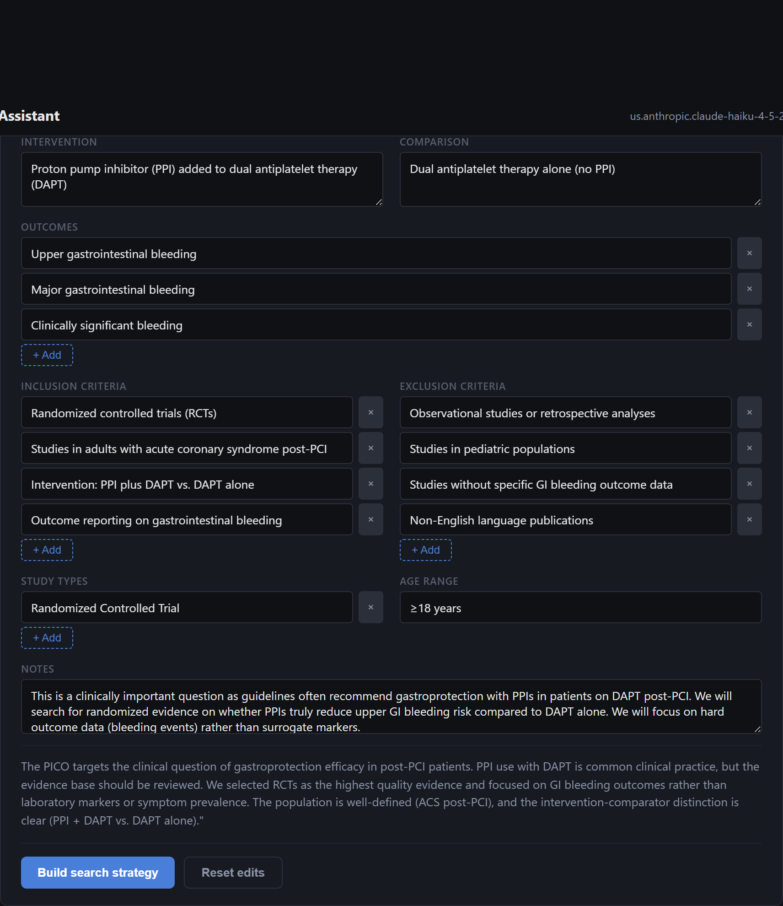

**Step 2 — At the PICO step, paste the PICO table** → the model runs the search (live PubMed) and
returns a **search_results** card. The synthetic studies won't be there — that's expected.

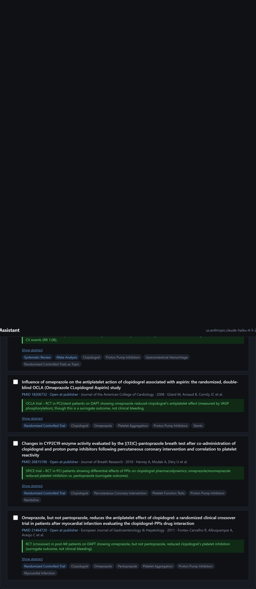

**Step 3 — Paste the extraction table** (8 fabricated RCTs) → a **data_extraction** card with every
row tagged `USER PROVIDED` + `complete`. (Showing 3 of 8 rows.)

```markdown
| Study | Year | Design | PPI events | PPI total | Control events | Control total | Follow-up (mo) |
|---|---|---|---|---|---|---|---|
| Anderson et al. | 2014 | Multicenter RCT | 12 | 1200 | 28 | 1198 | 12 |
| Bekele et al. | 2016 | Single-center RCT | 4 | 320 | 9 | 318 | 6 |
| ... (8 studies total) | | | | | | | |
```

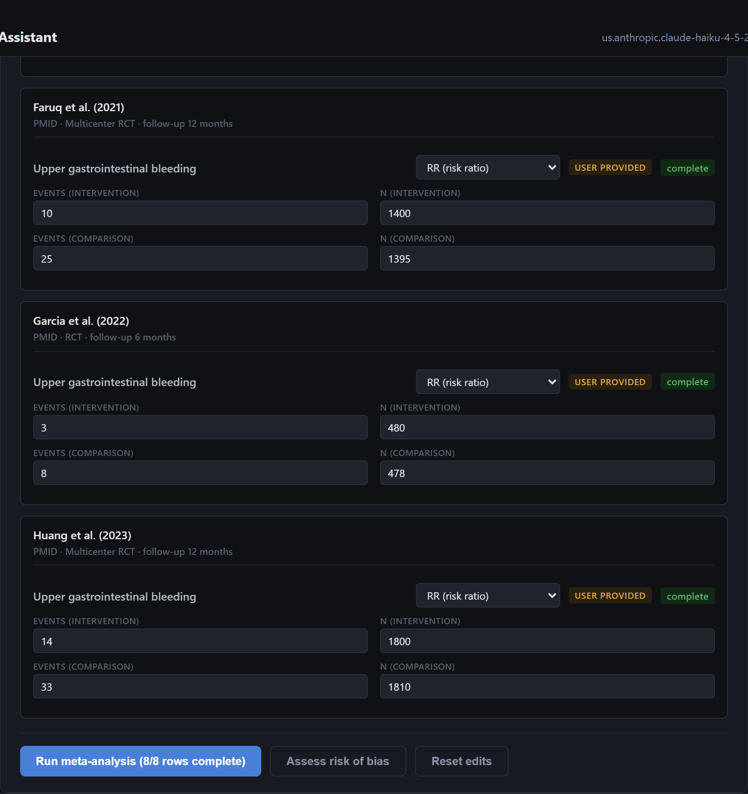

**Step 4 — Click "Run meta-analysis (8/8 rows complete)"** → the model calls `sandbox_exec`, which
renders the forest plot and pools the estimate.

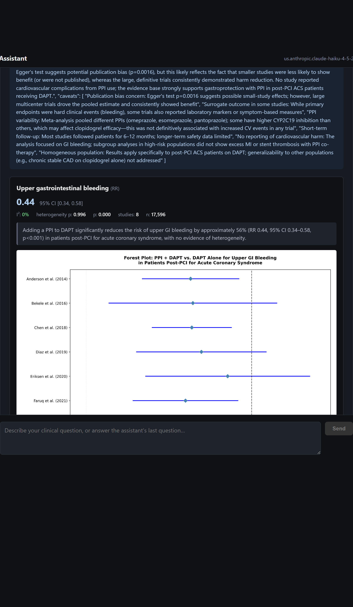

**Step 5 — Download** the manuscript-style report
([`phase01-evidence/e1-meta-analysis.pdf`](phase01-evidence/e1-meta-analysis.pdf)).

**Sanity checks:** pooled **RR ≈ 0.44 (95% CI 0.34–0.58)**, random-effects, 8 study rows + diamond,
n ≈ 17,596. The "Run meta-analysis" button (not a free-text "go ahead") is what emits the extraction
JSON that triggers the sandbox — anti-hallucination by design.

---

# E2 — Real evidence pipeline: Protocol → Search → Meta → RoB

Demonstrates **coherence across handoffs** — the same PICO carries through every specialist.

## E2a — PRISMA-P protocol drafter

**Trigger:** `/protocol SGLT2 inhibitors for HF prevention in T2DM`

The `protocol_methods` card lets you edit PICO + eligibility + synthesis plan before drafting.

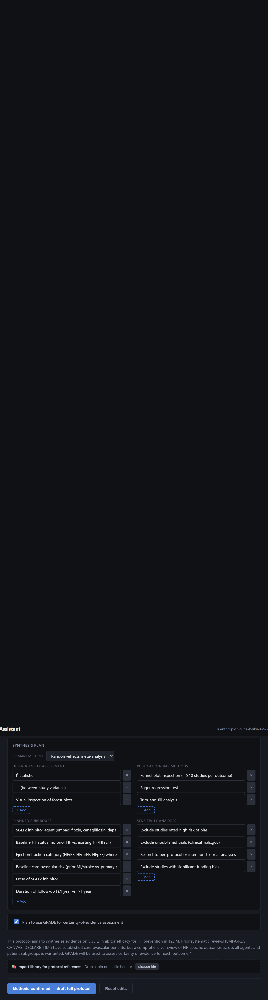

Click **Methods confirmed — draft full protocol** → a grounded `protocol_document` with numbered
citations + PROSPERO field map → **Finalize protocol** → final card with handoff buttons + PDF/DOCX.

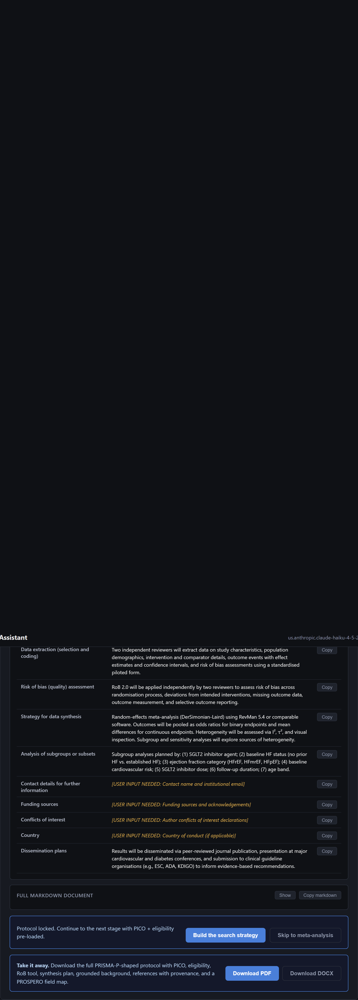

## E2b — Search strategy

**Trigger:** `/search proton pump inhibitor + DAPT in post-PCI ACS`

A `query_blocks` card with MeSH chips → **Confirm terms — compose & test** → a `strategy_result`
card with the composed Boolean query and **live PubMed hit counts**.

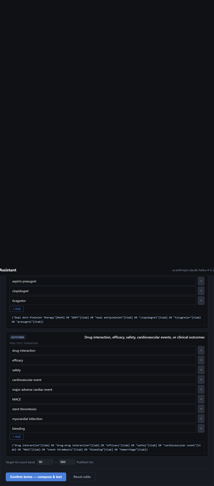
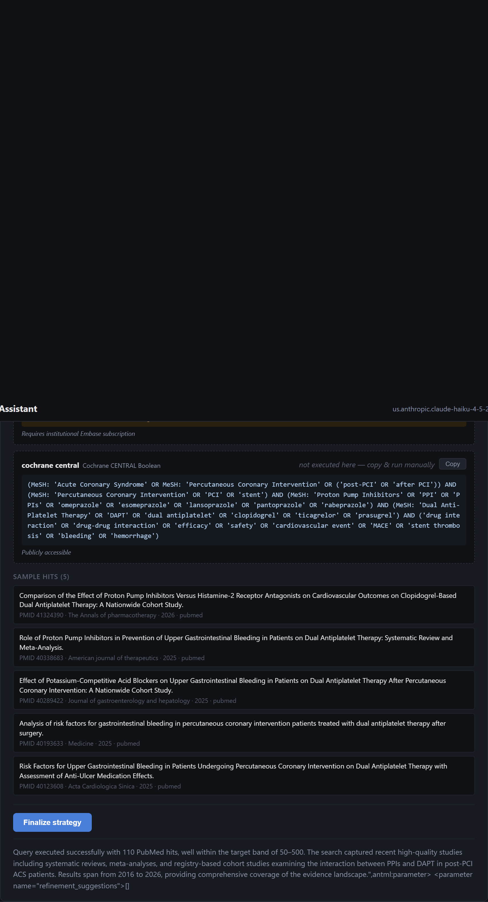

## E2c — Hand off to meta-analysis (narrated)

The finalized strategy card carries a **Run meta-analysis on these results** button; the
data-extraction card carries **Assess risk of bias**. Each seeds a new thread that arrives at the
right step with the prior context — the PICO never gets re-typed. (Drop in E1's synthetic extraction
for a deterministic forest plot.)

## E2d — Risk of bias

**Trigger:** `/rob Run RoB 2.0 on PMID 20925534, PMID 30873575, PMID 31091374`

A `rob_assessments` card with the RoB 2.0 domains per study (judgments editable, with verbatim quote
justifications pulled from the abstract).

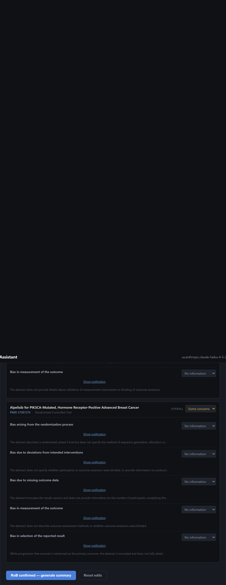

Click **RoB confirmed — generate summary** → a stacked-bar `rob_summary` + per-domain counts →
**Finalize RoB** → handoff to a sensitivity re-pool + PDF/DOCX.

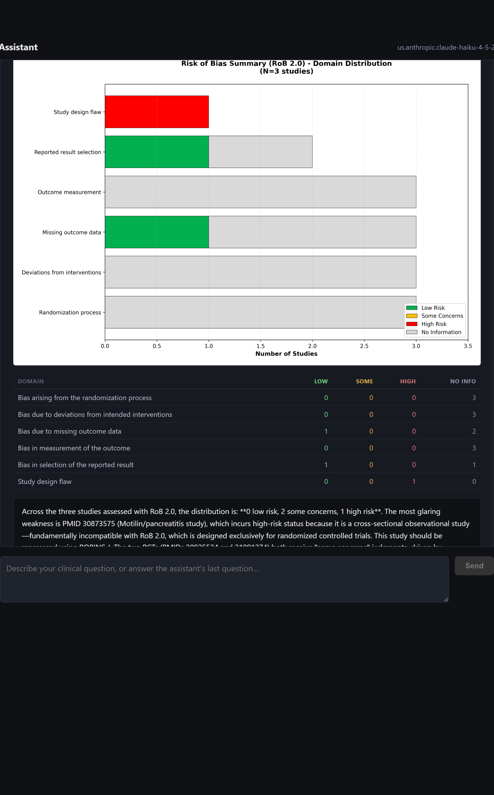

---

# E3 — SR title/abstract + full-text screening UI

The dual-review screening surface that bridges search (thousands of hits) and meta-analysis (the
dozen that qualify). **Open at `http://localhost:8000/sr.html`.**

**Step 1 — Create a project** (name, PICO, PubMed Boolean query, inclusion/exclusion criteria).

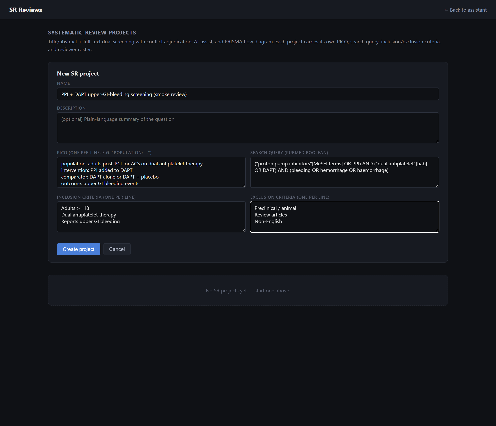

**Step 2 — Ingest + AI-assist.** Click **▶ Ingest from search** (live PubMed fan-out → here **52
candidates**) then **✨ AI-assist** (the `sr_screening_assist` specialist pre-classifies abstracts).

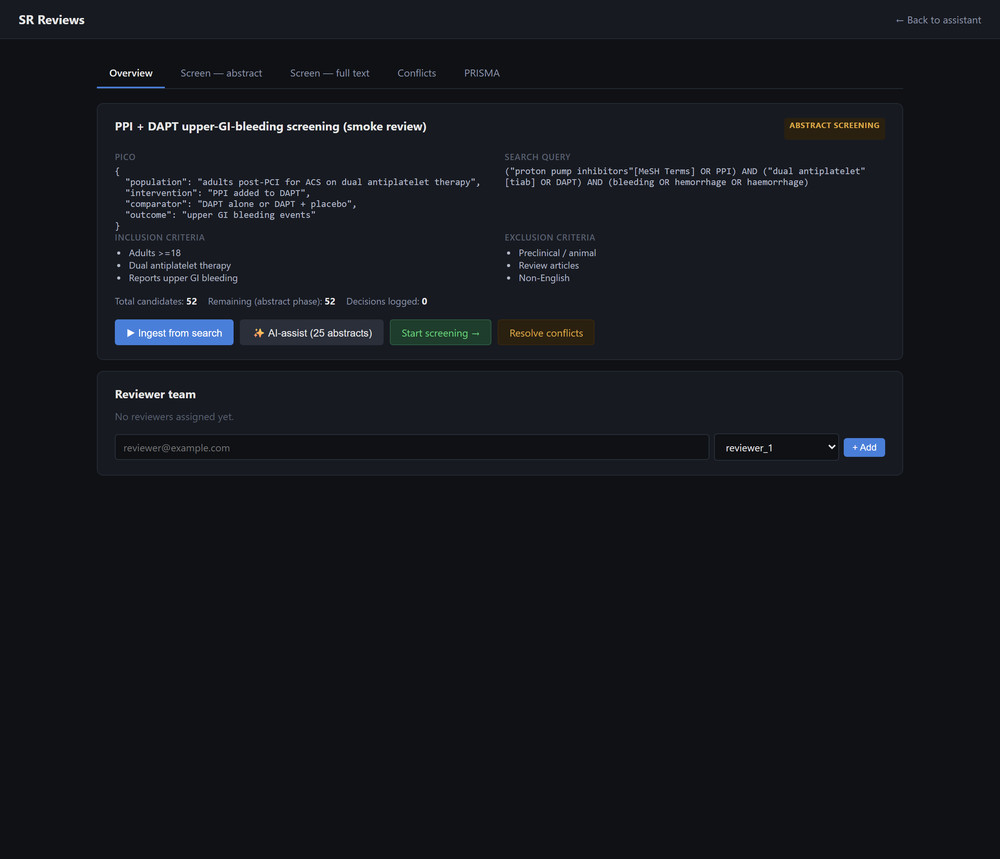

**Step 3 — Screen.** Each abstract shows an inline **AI-ASSIST** suggestion (include / exclude /
maybe + confidence + reasoning); reviewers decide with `i` / `e` / `m` keyboard shortcuts.

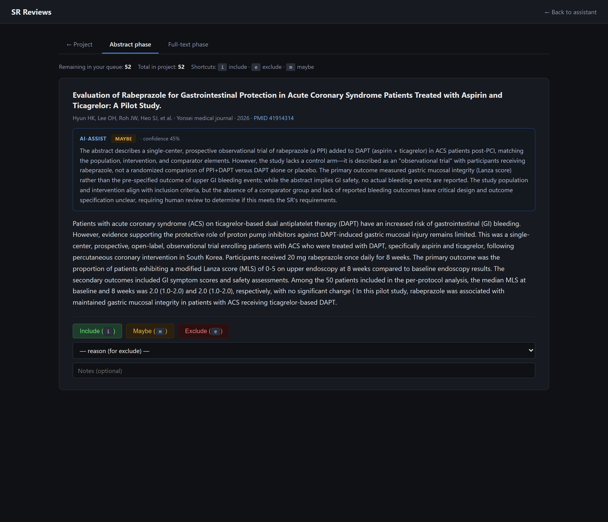

> **Dual review (narrated).** Reviewer 1 and Reviewer 2 screen **blind** to each other; conflicts
> surface in the **Conflicts** tab for an adjudicator. This requires separate user accounts, so it
> isn't shown in this single-user capture — the roster + roles (`reviewer_1` / `reviewer_2` /
> `adjudicator`) are managed in the "Reviewer team" panel on the overview.

**Step 4 — PRISMA flow.** The **PRISMA** tab renders a hand-rolled SVG with per-stage counts +
side exclusion boxes, derived entirely from candidate statuses (no fabrication).

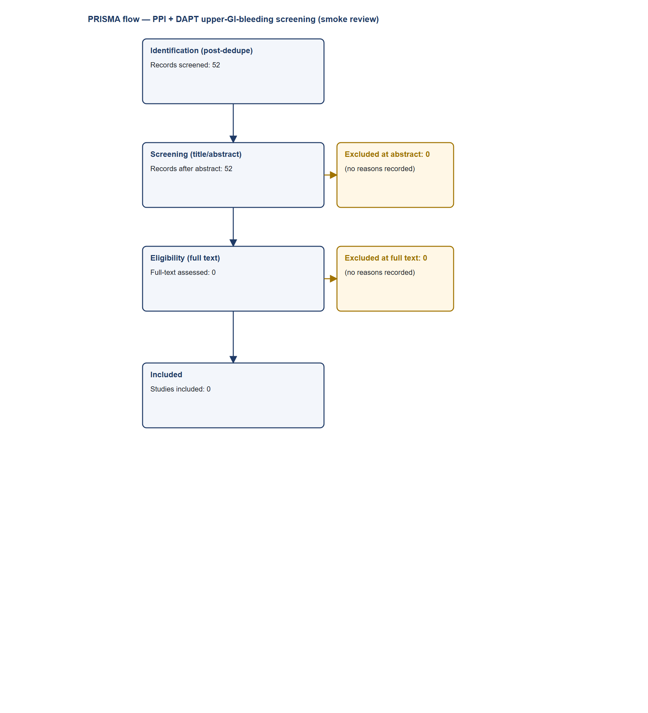

---

# E4–E8 — reference (trigger + expected output)

> Per the agreed scope, these five are documented here rather than captured screen-by-screen.
> E4/E5/E6 are chat workflows whose deliverable is a **downloadable PDF report** (they render as a
> generic card in chat); E7/E8 live on the dedicated `watches.html` page.

| Demo | Trigger / entry | What it produces |
|---|---|---|
| **E4 — Network meta-analysis** | `/nma compare five direct oral anticoagulants for stroke prevention in non-valvular AF — apixaban, dabigatran, edoxaban, rivaroxaban, warfarin` | 5-stage workflow → PicoNetwork (≥3 interventions + transitivity rationale) → per-arm extraction → **league table + SUCRA + network-geometry PNG** in a landscape PDF. Frequentist by default; type `Run Bayesian NMA` for the PyMC backend. |
| **E5 — IPD meta-analysis** | `/ipd individual patient data meta-analysis on statins for primary prevention of cardiovascular events` | 5-stage → bundle with per-trial CSV pastes → **one-stage + two-stage side-by-side** (divergence > 0.2 log-scale flags misspecification) → subgroup × treatment interaction → PDF. |
| **E6 — GRADE SoF + PRISMA 2020** | `/grade Generate a GRADE SoF for the PPI/DAPT meta-analysis` (needs a completed E1/E2 meta in-thread, or click **→ Draft GRADE** on the meta card) | Certainty **computed** (not asserted) from per-domain ratings; every downgrade cites a source number; 42-item PRISMA 2020 checklist; landscape PDF + DOCX. |
| **E7 — Living-review watch** | Build a search (E2b) → click **Watch this query** → set name + schedule + materiality (0.6) → **Create watch**. View at `http://localhost:8000/watches.html`. | Scheduled re-search; on each fire it diffs new PMIDs vs baseline, triages materiality, and lights the notification bell. **Run now** triggers it on demand. |
| **E8 — Group subscriptions (quorum)** | `watches.html` → **Group subscriptions** → **+ New subscription** (pick a watch, min votes, min fraction) → **Manage members** (voters / observers) → vote on a run. | Committee-style consensus: quorum = `yes ≥ max(min_votes, ⌈min_fraction × n_voters⌉)`; observers excluded from the denominator; on quorum the whole panel is notified. (Multi-voter quorum needs multiple accounts.) |

---

## Reproduce

```bash
uv run python scripts/demo_e1_meta.py       # E1 -> phase01-evidence/e1-*
uv run python scripts/demo_e2_pipeline.py   # E2 -> phase01-evidence/e2*
uv run python scripts/demo_e3_sr.py         # E3 -> phase01-evidence/e3-*
```
