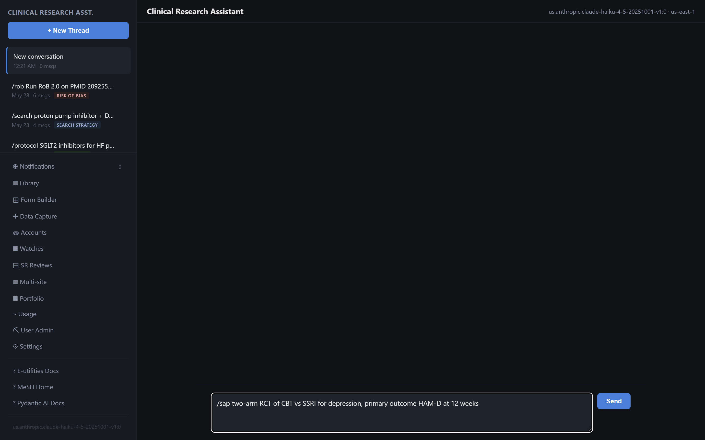
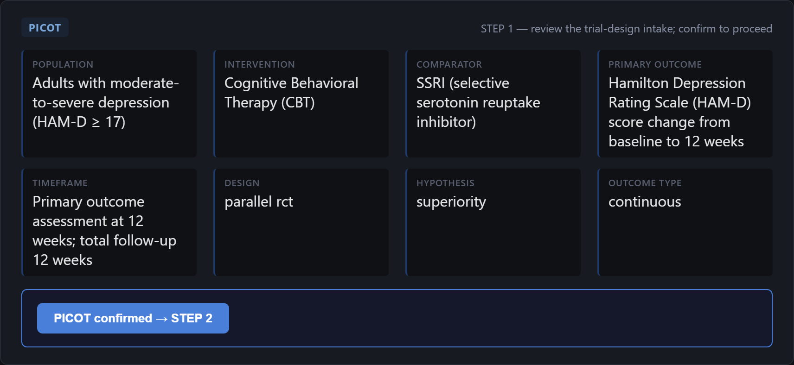
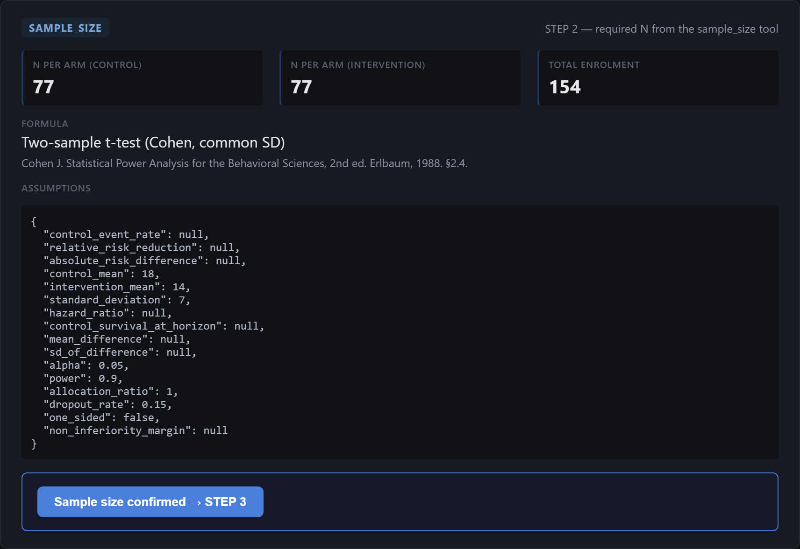
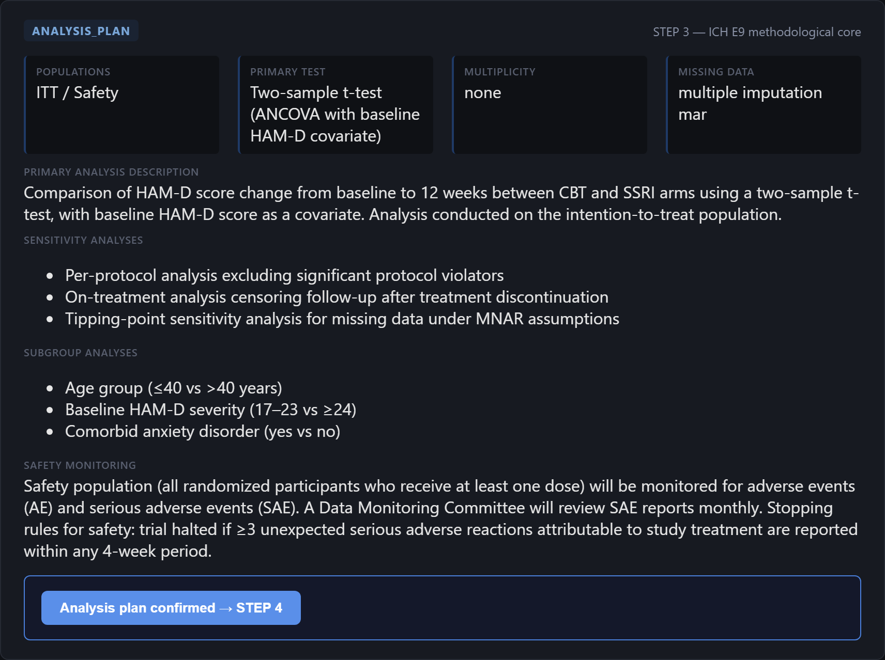
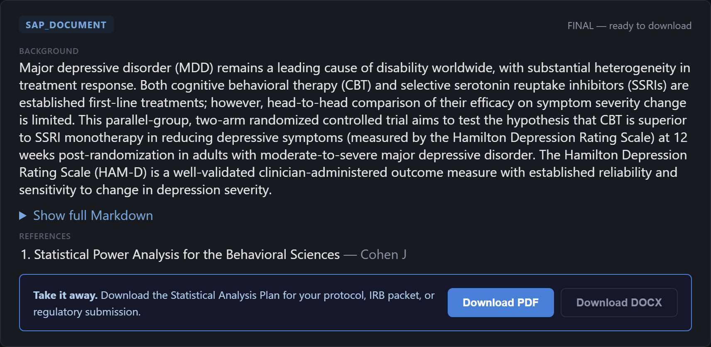
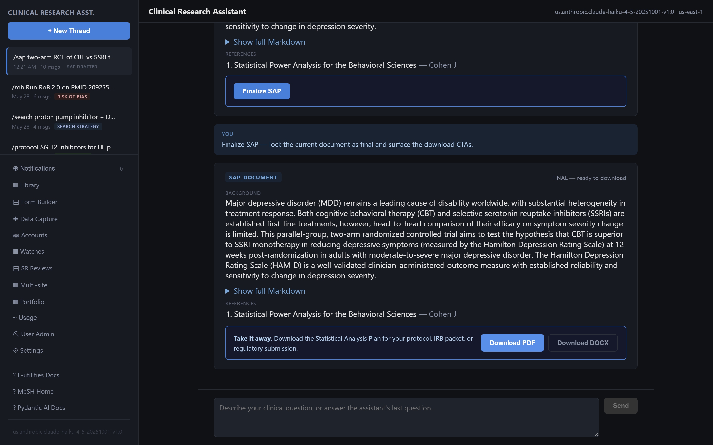

# Phase 02 — Trial design · Pictorial walkthrough (D1: Sample-size + SAP drafter)

> **Phase context.** Once the evidence base supports a new trial, the team specifies the
> question (PICOT), powers it (sample size), and writes the analysis plan. Deliverable:
> an ICH-E9-shaped **Statistical Analysis Plan** (PDF + DOCX), often submitted to peer
> review before any subject enrols.

This guide was captured against a **live instance** (`http://localhost:8000`, AWS Bedrock
`claude-haiku-4-5`) on 2026-06-19. Every screenshot below is a real render of the running app.

The workflow has four stages: **PICOT intake → sample-size derivation → ICH-E9 analysis plan → assembled SAP**.
The `sample_size` calculator runs host-side on `scipy.stats` (no sandbox round-trip); every
other card is produced by the `sap_drafter` specialist on Bedrock.

---


## Step 1 — New conversation, trigger the SAP workflow

Click **+ New Thread**, then paste the trigger into the composer and **Send**:

```
/sap two-arm RCT of CBT vs SSRI for depression, primary outcome HAM-D at 12 weeks
```



---

## Step 2 — Review the PICOT intake card (STEP 1)

The model parses the trigger into a structured **PICOT** card — Population, Intervention,
Comparator, Primary outcome, Timeframe, plus design / hypothesis / outcome-type. Review and edit
inline if needed.



---

## Step 3 — Confirm PICOT **and supply the statistical assumptions** (STEP 2)

The drafter will **not invent an effect size** — a deliberate anti-hallucination guardrail. So
instead of just clicking *PICOT confirmed*, answer with the confirmation **and** the assumptions in
one message:

```
PICOT confirmed. For STEP 2 use a two-sample t-test: control HAM-D mean 18,
intervention mean 14 (mean difference 4), common SD 7, alpha 0.05, power 0.90,
allocation 1:1, 15% dropout.
```

The `sample_size` tool computes **N = 77 per arm, 154 total** (Cohen two-sample t-test), echoing
back every assumption so the derivation is auditable. Click **Sample size confirmed → STEP 3**.



---

## Step 4 — Review the ICH-E9 analysis plan (STEP 3)

The drafter produces the methodological core: analysis populations (ITT / Safety), primary test
(ANCOVA on HAM-D with baseline covariate), multiplicity strategy, missing-data handling, plus
sensitivity / subgroup analyses and safety monitoring. Click **Analysis plan confirmed → STEP 4**.



---

## Step 5 — Assemble the SAP (STEP 4), then finalize

The assembled **SAP document** card appears in draft state with a grounded background paragraph,
references, and a *Show full Markdown* expander. Iterate with free-form messages, or click
**Finalize SAP** to lock it.



---

## Step 6 — Download the report

The finalized card surfaces **Download PDF / Download DOCX**. The PDF
([`phase02-sap/sap-report.pdf`](phase02-sap/sap-report.pdf)) bundles: Title · PICOT · Sample size ·
Analysis plan · Methods · Assumptions.



---

## Sanity checks (acceptance criteria)

| Check | Expected | Observed |
|---|---|---|
| Sample-size shape | `N_per_arm`, `total_n`, dropout-inflated N, formula, assumptions echoed | ✅ 77 / 77 / 154, Cohen two-sample t-test |
| Effect size never fabricated | Drafter asks for assumptions rather than inventing them | ✅ supplied by operator |
| Estimands / ICH-E9 framing | Populations + primary test + multiplicity + missing-data on the analysis card | ✅ ITT/Safety, ANCOVA, multiple imputation |
| Downloadable artefact | PDF + DOCX from the final card | ✅ valid 2-page `%PDF-1.4` |

**Variant to narrate:** the four superiority formulas (two-proportions / two-means / Schoenfeld
time-to-event / paired) ship today; non-inferiority + equivalence are roadmap items.

---

## Reproduce

```bash
uv run python scripts/demo_capture_d1_sap.py   # re-captures every screenshot in phase02-sap/
```
