# Phase 04 — Execution · eCRF Pictorial walkthrough (X1: Form Builder + X2: EDC capture)

> **Phase context.** Once the trial is approved and registered, real subjects enrol and real data
> accumulates. The eCRF subsystem is the platform's regulatory-grade data-capture core
> (Part 11 / ALCOA+ / GCP / ICH E6). This guide walks the two foundational demos:
> **X1 — design CRFs from a protocol** (admin / data-manager), and
> **X2 — capture subject data with edit-checks + queries** (site coordinator).

Captured against a **live instance** (`http://localhost:8000`, Bedrock `claude-haiku-4-5`) on
2026-06-19. The two eCRF pages are plain vanilla JS (no React/Babel), so they are unaffected by the
chat-UI Babel issue noted in the Phase 02 guide.

**Surfaces used:**

```
http://localhost:8000/ecrf.html        — Form Builder (X1)
http://localhost:8000/collector.html   — Site EDC capture (X2)
```

---

# X1 — eCRF design (AI-draft CRFs from a protocol)

## Step 1 — Open the Form Builder

`http://localhost:8000/ecrf.html`. Left column = Studies / Forms / AI draft; right column = the
form-definition editor.

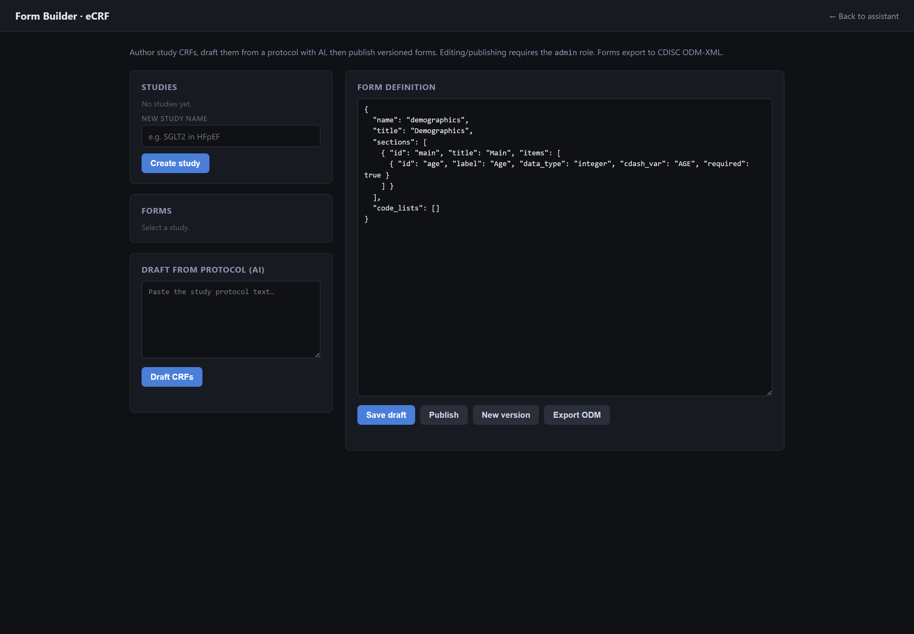

## Step 2 — Create the study

Type a name and click **Create study**, then select it. (We used
`SMOKE-T2DM-001 — Phase 2 SGLT2i in adults with T2DM (smoke study)`.)

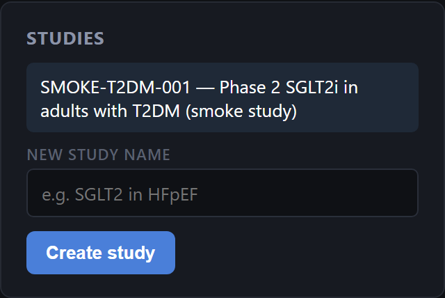

## Step 3 — Paste the protocol into "Draft from protocol (AI)"

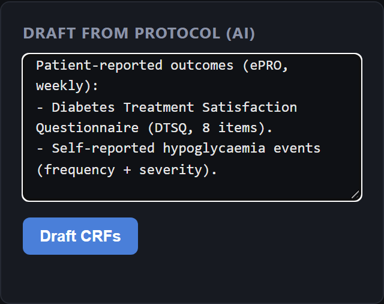

<details><summary>Protocol text used</summary>

```
Phase 2, single-arm, open-label study of an SGLT2 inhibitor in adults with type 2 diabetes mellitus.

Eligibility:
- Adults aged 18-75 years.
- HbA1c 7.0-10.0% at screening.
- On stable metformin >=3 months prior to enrolment.
- BMI 22-40 kg/m2.

Schedule of assessments:
- Visit 1 (Baseline, Week 0): consent, demographics, vital signs, fasting glucose, HbA1c, body weight, eligibility verification, study-drug dispensing.
- Visit 2 (Week 4): vital signs, fasting glucose, AE review.
- Visit 3 (Week 12): vital signs, fasting glucose, HbA1c, body weight, AE review, lab safety panel.
- Visit 4 (Week 24, primary endpoint): vital signs, fasting glucose, HbA1c, body weight, AE review, lab safety panel.
- Visit 5 (EOS, Week 28): final vital signs, AE review, treatment-emergent serious AE inventory.

Primary outcome: change in HbA1c from baseline to Week 24.
Secondary outcomes: fasting glucose, body weight, proportion with HbA1c <7.0% at Week 24.
Safety outcomes: vital signs, lab safety panel, treatment-emergent adverse events (graded per CTCAE v5).

Patient-reported outcomes (ePRO, weekly):
- Diabetes Treatment Satisfaction Questionnaire (DTSQ, 8 items).
- Self-reported hypoglycaemia events (frequency + severity).
```
</details>

## Step 4 — Draft the CRFs

Click **Draft CRFs** (~10–40 s on Bedrock). The model proposes a full form set — Demographics,
Eligibility, Vital Signs, Lab Safety, Body Weight/BMI, AE Reporting, Study-Drug, DTSQ ePRO,
Hypoglycaemia. **Nothing auto-saves.**

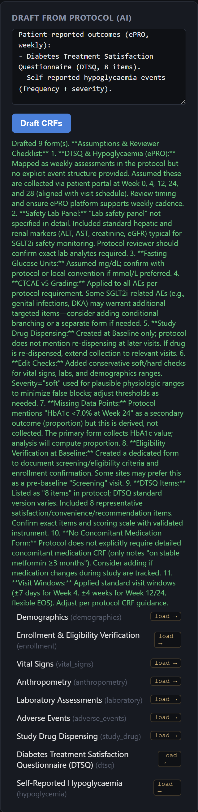

## Step 5 — Load a draft into the editor

Click a drafted form (here **Vital Signs**) to load its JSON. Note the CDASH naming (`cdash_var:
VSORRES`/`SYSBP`), the structured items, and the AI's starting edit-check.

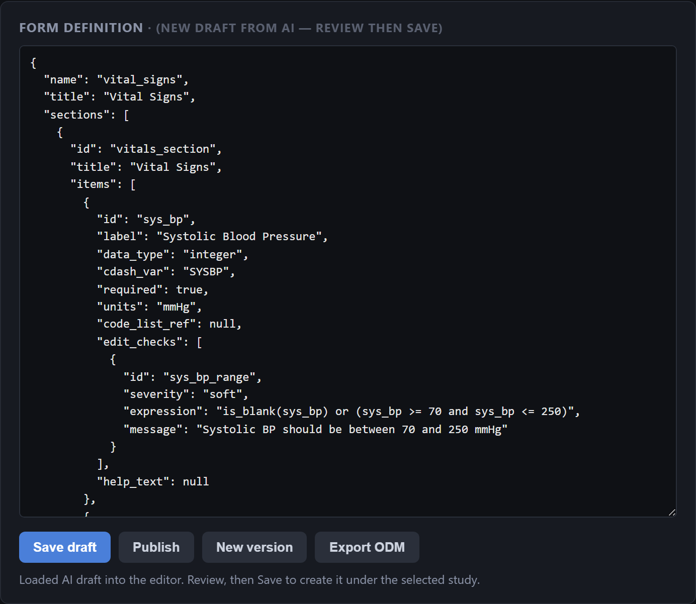

## Step 6 — Designer review: harden an edit-check (human-in-the-loop)

The designer reviews and **edits** before publishing. Here we upgrade the systolic-BP range check
to **hard** (blocks save) and add a **soft** >180 warning (auto-raises a query). This demonstrates
that the AI draft is a starting point, not an auto-published artefact.

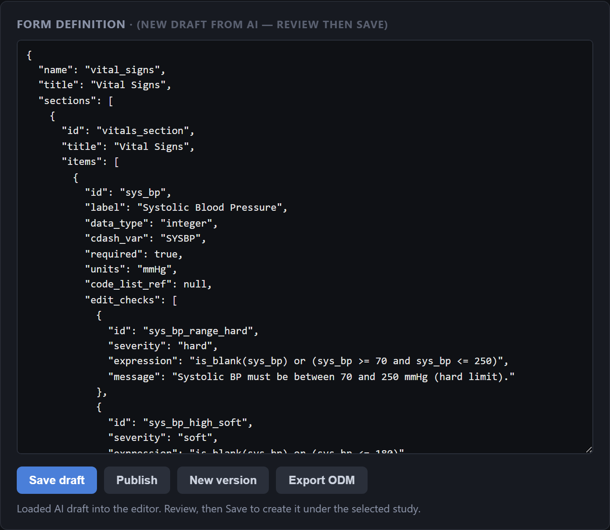

## Step 7 — Save the draft, then Publish (immutable)

**Save draft** → form lands at `status=draft`. **Publish** → `draft → published`; the definition is
now immutable (further edits require **New version**).

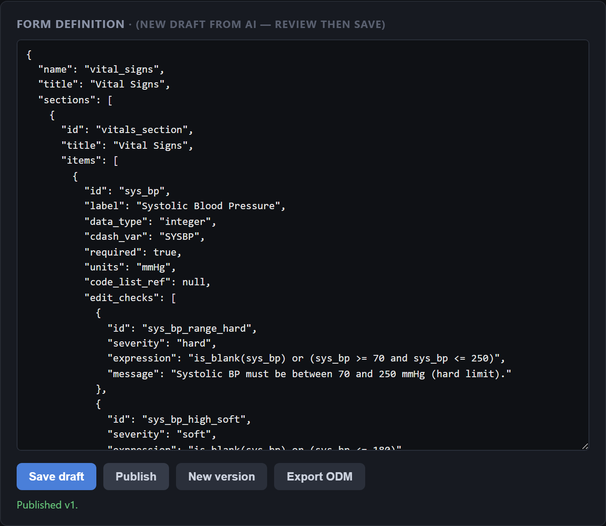
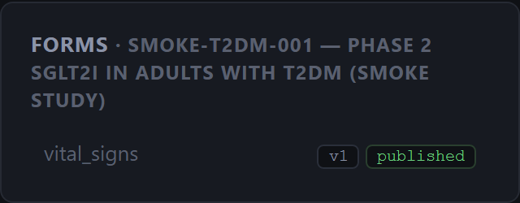

## Step 8 — Export CDISC ODM-XML

**Export ODM** downloads a CDISC ODM v1.3.2 document
([`phase04-ecrf/form.odm.xml`](phase04-ecrf/form.odm.xml)) with `Study` + `FormDef` + `ItemDef`s.

### X1 sanity checks

| Check | Expected | Observed |
|---|---|---|
| Nothing auto-publishes | Drafted forms stay until you Save | ✅ |
| CDASH naming | Demographics/VS fields follow CDASH (`VSORRES`, `SYSBP`…) | ✅ |
| Hard vs soft checks distinct | Hard blocks; soft warns | ✅ (set in Step 6) |
| Published forms immutable | `PUT` on a published form → 409; must New-version | ✅ |
| ODM export | Valid CDISC ODM-XML | ✅ v1.3.2 |

---

# X2 — EDC capture (site coordinator)

**Pre-req:** X1 published the Vital Signs form. A deployment snapshots published form definitions.

> **Note:** `collector.html` has **no "New deployment" button** — deployments are created via the
> EDC API (`POST /api/edc/deployments` with the published `research_study_id`). The capture script
> creates the *Smoke deployment* this way, then drives the page. Everything below is the
> coordinator's day-to-day surface.

## Step 1 — Open the collector, select the deployment

`http://localhost:8000/collector.html` → pick **Smoke deployment** in the Deployment dropdown.

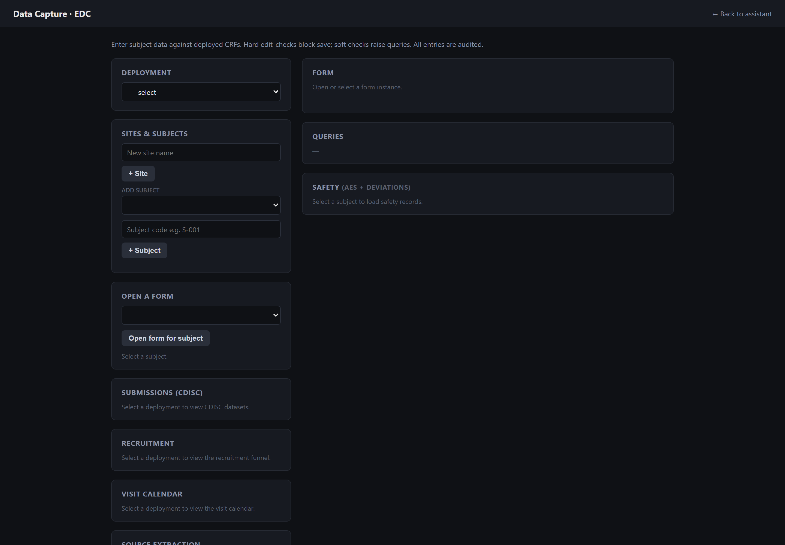

## Step 2 — Add a site and a subject

Add site `Site 01 — University Hospital`, then add subject `S01-001` against that site.

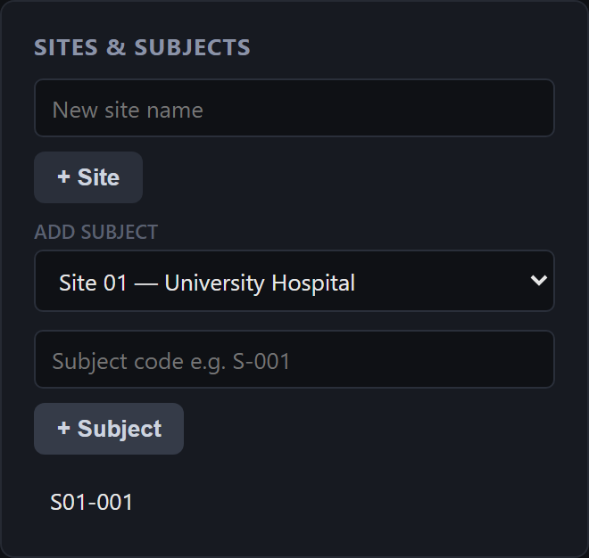

## Step 3 — Open the Vital Signs form for the subject

Select the subject, pick **Vital Signs** in the deployed-forms dropdown, and **Open form for
subject** → creates a `FormInstance` at `status=in_progress`.

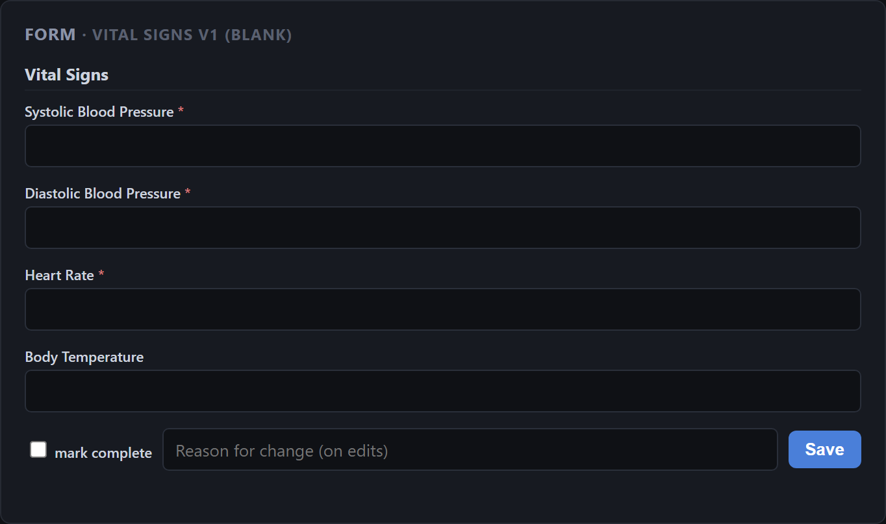

## Step 4 — Enter valid data → save succeeds

Systolic 120 / Diastolic 78 / Heart rate 72 → **Save** → persists to `ItemData` (status saved).

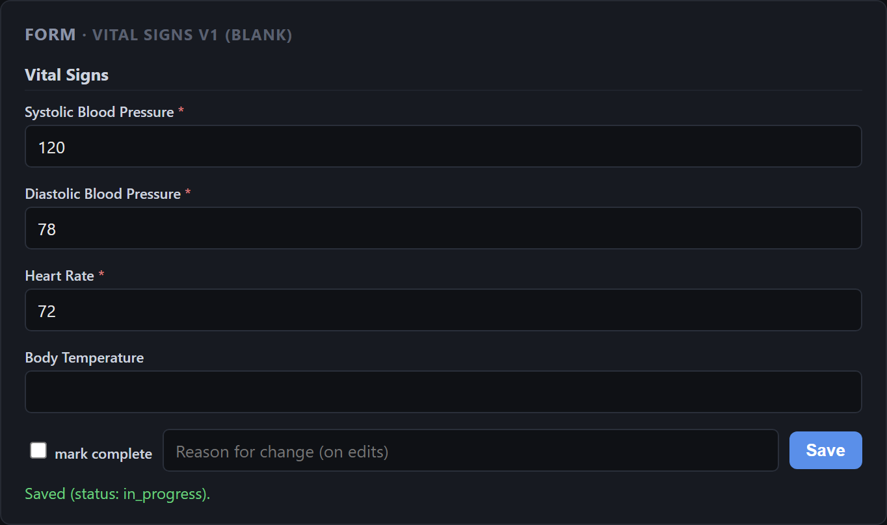

## Step 5 — Hard edit-check → save blocked (422)

Set systolic BP to **300** (outside the hard 70–250 limit) → **Save** → **422, nothing persisted**.
The offending field shows a red inline failure and the status reads *"Hard check(s) failed —
nothing saved."*

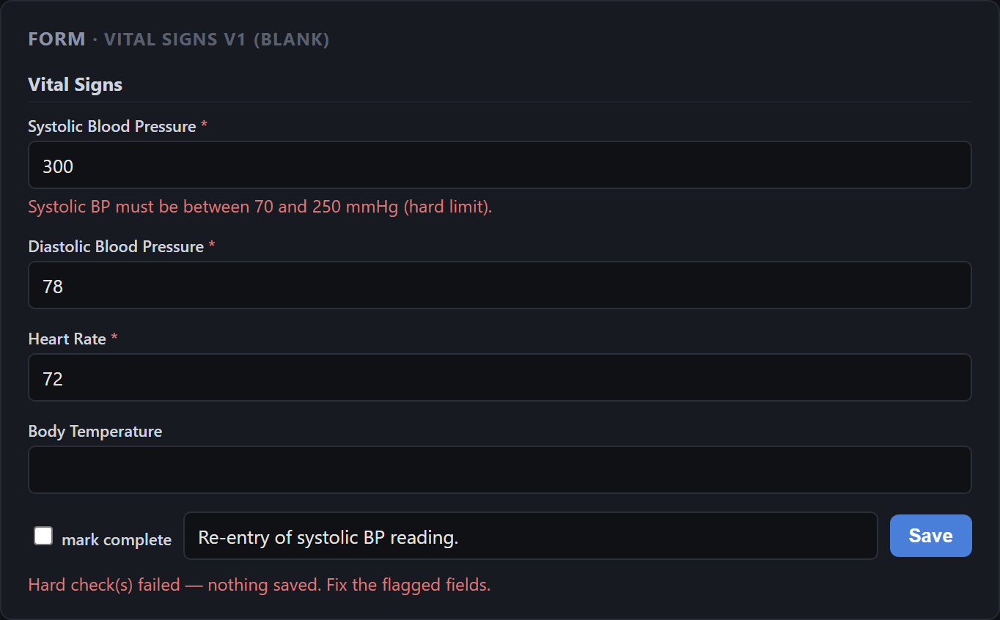

## Step 6 — Soft edit-check → saves **and auto-raises a query**

Correct to systolic BP **200** (within the hard limit, but above the soft 180 threshold) → **Save**
→ data **saves** *and* an **auto query** appears in the Queries panel referencing the offending
`item_id`.

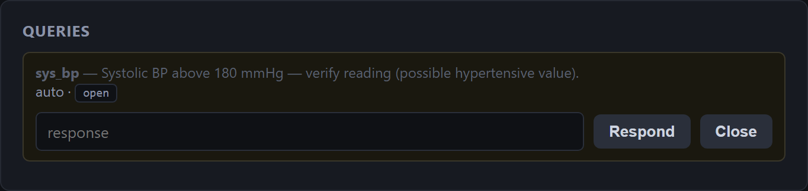

From here the coordinator/monitor can **Respond** or **Close** the query — the full
query-lifecycle.

### X2 sanity checks

| Check | Expected | Observed |
|---|---|---|
| Hard check | Blocked save, 422, no `ItemData` written | ✅ BP 300 → 422 |
| Soft check | Saves **and** auto-raises a query referencing the `item_id` + rule | ✅ BP 200 → `sys_bp` query |
| Audit trail | Every save records `AuditEntry` (old→new, actor, source=edc) | inspect `GET /api/edc/form-instances/{id}/audit` |

---


